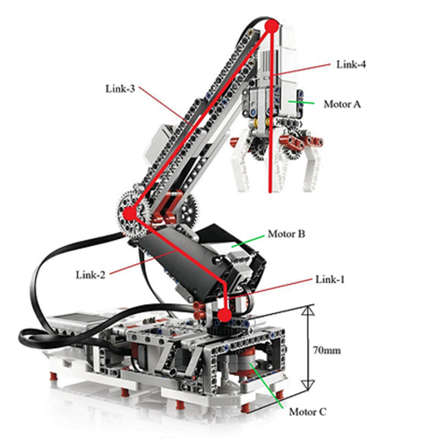
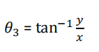
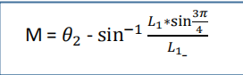

# Manipulator-Robot-Pick-and-Place

This project focuses on Inverse Kinematic modelling and using PID control algorithm to achive the task of picking up and placing object according to input coordinates in 3D space. MATLAB is used for programming.

# Inverse Kinematic modelling
The following robot is used for this project. We have three motors as shown in the figure to be controlled. 

  

Motor C is controlled by this equation: 

  

Motor B is controlled by this equation: 

  

# Homing, picking and placing behaviors of robot

## Homing
In our robot base touch sensor is at station A. So we consider it as an initial position for robot and from this initial 
position we are starting pick and place operations at any arbitrary position. For gripper we assume initially always open. If it is close we fully close it by running gripper motor (motor1) large amount of time (1 second) and after that we open it by providing alternative speed. For example if initially positive than providing negative speed vice versa. Tuning time to open the gripper after providing speed to gripper motor is 0.20 seconds.

## Picking

Picking task involves controlling the following motors in a sequence: firstly, the base motor, then elbow 
motor to place the gripper around the object, gripper motor to hold the object and finally the elbow 
motor to lift up the object.

### Base motor control

The base motor (base motor) is controlled by taking current angle (motor 3 encoder data) and 
comparing it with the desired angle ( 𝜃3) calculated through inverse kinematic equations. The current 
angle of the base motor is checked in every short interval of time and 
compared with respect to the desired angle. 

### Elbow motor control

The control algorithm of elbow motor is similar to the base motor. It is controlled by taking current 
angle (motor 2 encoder data) and comparing it with the desired angle (Mi-M) calculated through inverse 
kinematic equations. The current angle of the elbow motor is checked in every short interval of time and compared with respect to the desired angle.

### Gripping 

The gripper is opened at the homing position by giving a suitable speed for few milliseconds. Then, the 
speed with reversed sign as the compared to the last gripper speed (positive in this case) is again 
provided for few milliseconds to close the gripper to hold the ball.

### Retraction

The elbow motor is given a negative speed to move the object up till a desired angle is reached. The 
speed is then made zero.

## Placing

After picking is completed, next we must place the ball at the desired position. Placing is achieved in the 
following sequence: a) Base Motor Control, b) Elbow Motor Control, c) Gripper Motor Control, d)
Retracting the Elbow.

# Repo structure

code: contains all the code for homing, picking, placing, calculating inverse kinematics.

# References

https://de.mathworks.com/help/supportpkg/legomindstormsev3io/ref/motor.html
https://www.hisour.com/behavior-based-robotics-43217/
https://de.mathworks.com/discovery/inverse-kinematics.html

